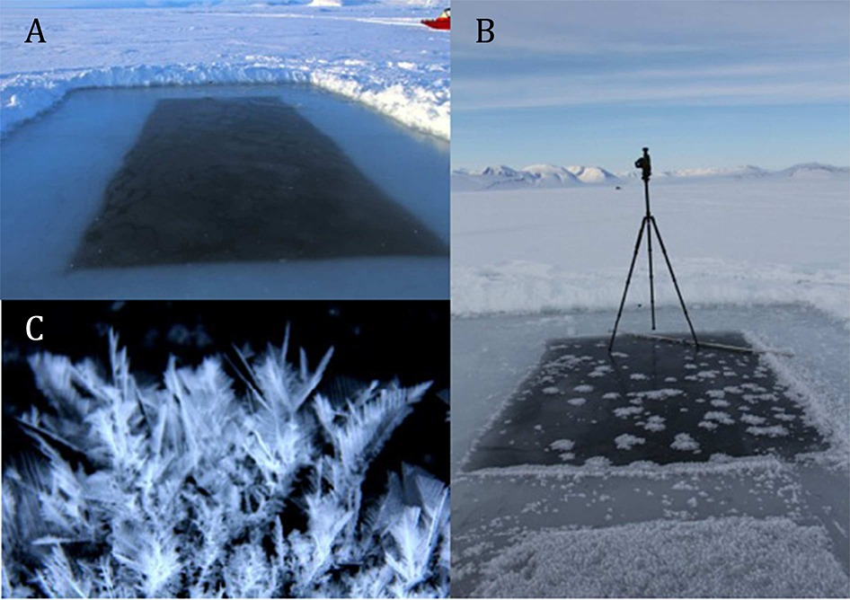

# **Oceanography** {-#ocean} 

This section features a dataset from the field of oceanography, the study of the physical and biological aspects of the ocean. 

The Arctic Ocean is the shallowest ocean on Earth. Its complex oceanographic configuration is tightly linked to the atmosphere, the land, and the cryosphere. The physical dynamics not only drive important climate and global circulation patterns, but also control biogeochemical cycles and ecosystem dynamics. Current changes in Arctic sea ice thickness and distribution, air and water temperatures, and water column stability are resulting in measurable shifts in the properties and functioning of the ocean and its ecosystems [(Gradinger, 1995)](https://doi.org/10.1029/2017EO064803). 

The Arctic Ocean is forecasted to shift to a seasonally ice-free ocean resulting in changes to physical, chemical, and biological processes [(Notz & Stroeve, 2018)](https://doi.org/10.1007/s40641-018-0113-2). These changes include the exchange of gases across the atmosphere-ocean interface, the wind-driven circulation and mixing regimes, light and nutrient availability for primary production, food web dynamics, and export of material to the deep ocean. In anticipation of these changes, extending our knowledge of the present Arctic oceanography and these complex changes has never been more urgent. 

## Frost flowers on young Arctic sea ice {-#ocean-section}

 

**The Data**

[Frost flowers in Arctic winter: Sea-to-air transport of microbes and viruses.](https://arcticdata.io/catalog/view/urn%3Auuid%3A50417411-7b5f-4835-96fa-5eb835f980df)

This dataset is brought to you by [ Jody W. Deming](https://www.ocean.washington.edu/story/Jody_Deming_Ecosystem) (she/her), an American oceanographer. She is a professor of Oceanography and a marine microbiologist at the University of Washington. Her research interests include studies of cold adapted microbes in their relation to astrobiology, biotechnology, and bioremediation.

The full paper associated with this dataset is avalible [here](https://agupubs.onlinelibrary.wiley.com/doi/full/10.1002/2014JD021736).

**What we know**

New ice is becoming more common in the Arctic due to warming, so frost flowers - a phenomenon usually associated with new ice - are predicted to appear more often. Frost flowers are short lived clusters of ice crystals that form tree or snowflake-like structures on the warm, salty ice surface and the cold air in calm water conditions. These frost flowers are a way for the ocean to chemically react with the atmosphere, and are a potential source of a number of different aerosol comounds, like salts, organic particles, bromines, and/or halogens with a large mercury percentage. Frost flowers can also serve as a cryospheric habitat for microbs. The goal of this study was to investigate these frost flowers and understand what processes drive their growth and decay, as well as eamine their roles in geochemical and biological exchange.

To investigate their microbiology, Bowman and Deming learned to grow frost flowers in a freezer lab at the University of Washington. Then then moved their study into the field, collecting frost flowers during several challenging expeditions at sea. With these first samples, they have begun to develop the concept of frost flowers as a microbial habitat. Their goal is to probe the secrets of microbial life in very cold environments, a priority shared with the [astrobiology](https://astrobiology.nasa.gov/about/) community. Since many of the planets and moons in our solar system that might harbor life are very cold and covered in ice, determining the habitability of these planets and moons requires an understanding of the limits of life (as we know it) in the very coldest environments on Earth.

**What we found out**

Ice grown in a pond that researchers cut in young, newly-formed ice at the mouth of Young Sound, NE Greenland, in March 2012, showed that expanding frost flower clusters began forming as soon as the ice formed. The new ice and frost flowers dramatically changed the thermal environment of the top layer of the ocean / atmosphere interface. The frost flowers were about 5°C colder than the brine surfac. More work needs to be done to understand the impact these frost flowers will have on the heat flux of the overall environment.

In terms of how these frost flowers were formed, the researchers found out that they primarily take brine crystals from the salty top layer of the ice. When the frost flowers form, a type of calcium carbonate (CaCO3) called ikalite is also formed, which has the ability to alter the carbon flux dynamics.

Bacteria concentrations generally increased with salinity in frost flowers and the surface slush layer, and the researchers found that largely the bacteria were brought into the structure of hte frost flower by passive diffusion. 

With more forst flowers expected in the future, more study is needed in all three areas of interest!

 
{width="70%"}

 

*Daneborg field station at the NE Greenland coast showing (a) the location of the Young Sound fjord and (b) the newly formed ice in the polynya at the mouth of the fjord where (c) the frost flower pond was constructed. Figure from  Barber et al. 2014.*

 
{width="70%"}

 

*What the frost flowers looked like a) when the pond ice was first cut and b) after 3 hours into the experiment, and c) a close up after 48 hours. Figure from  Barber et al. 2014.*

**What's in the Data**

This parent dataset contains 3 nested datasets:

- [Bacterial and extracellular polysaccharide content of brine-wetted snow over Arctic winter first-year ice](https://doi.org/10.18739/A2H92P)
- [Frost flowers on young Arctic sea ice: The climatic, chemical and microbial significance of an emerging ice type](https://doi.org/10.18739/A2N036)
- [Elevated bacterial abundance and exopolymers in saline frost flowers and implications for atmospheric chemistry and microbial dispersal](https://doi.org/10.18739/A2RS66)