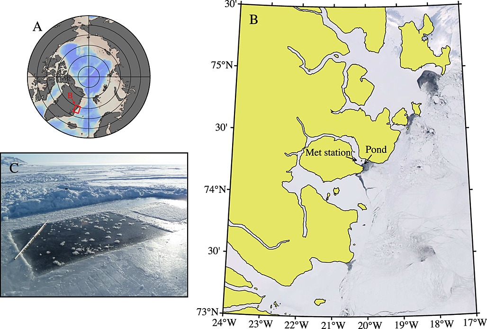

# **Oceanography** {-#ocean} 

This section features datasets from the field of oceanography, the study of the physical and biological aspects of the ocean. 

The Arctic ocean is, on average, the shallowest of Earth’s oceans. The Arctic Ocean’s complex oceanographic configuration is tightly linked to the atmosphere, the land, and the cryosphere. The physical dynamics not only drive important climate and global circulation patterns, but also control biogeochemical cycles and ecosystem dynamics. Current changes in Arctic sea-ice thickness and distribution, air and water tempera=tures, and water column stability are resulting in measurable shifts in the properties and functioning of the ocean and its ecosystems. 

The Arctic Ocean is forecast to shift to a seasonally ice-free ocean resulting in changes to physical, chemical, and biological processes. These include the exchange of gases across the atmosphere-ocean interface, the wind-driven ciruclation and mixing regimes, light and nuti lrient availability for primary production, food web dynamics, and export of material to the deep ocean. In anticipation of these changes, extending our knowledge of the present Arctic oceanography and these complex changes has never been more urgent. 

## Frost flowers on young Arctic sea ice {-#section}

 

**The Data**

[Frost flowers on young Arctic sea ice: The climatic, chemical and microbial significance of an emerging ice type](https://arcticdata.io/catalog/view/doi%3A10.18739%2FA2N036)

This dataset is brought to you by [ Jody W. Deming](https://www.ocean.washington.edu/story/Jody_Deming_Ecosystem) (she/her), an American oceanographer. She is a professor of Oceanography and a marine microbiologist at the University of Washington. Her research interests include studies of cold adapted microbes in their relation to astrobiology, biotechnology, and bioremediation.

The full paper associated with this dataset is avalible [here](https://agupubs.onlinelibrary.wiley.com/doi/full/10.1002/2014JD021736).

**What we know**

Frost flowers are highly saline ice structures that grow on the surface of young sea ice, a spatially extensive environment of increasing importance in the Arctic Ocean. Although frost flower blooms are frequently observed in both polar oceans, little is understood about the physical, chemical and biological nature of these structures. To investigate their microbiology Bowman and Deming learned to grow frost flowers in a freezer lab at the University of Washington before moving their study into the field, collecting frost flowers during several challenging expeditions. With these first samples they have begun to develop the concept of frost flowers as a microbial habitat. Their goal is to probe the secrets of microbial life in very cold environments, a priority of the astrobiology community. Since many of the planets and moons in our solar system that might harbor life are very cold and covered in ice, determining the habitability of these planets and moons requires an understanding of the limits of life (as we know it) in the very coldest environments on Earth.

**What we found out**

Ice grown in a pond cut in young ice at the mouth of Young Sound, NE Greenland, in March 2012, showed that expanding frost flower clusters began forming as soon as the ice formed. The new ice and frost flowers dramatically changed the radiative and thermal environment. The frost flowers were about 5°C colder than the brine surface, with an approximately linear temperature gradient from their base to their upper tips. 

Bacteria concentrations generally increased with salinity in frost flowers and the surface slush layer. Bacterial densities and taxa indicated that a selective process occurred at the ice surface and confirmed the general pattern of primary oceanic origin versus negligible atmospheric deposition.

 
{width="70%"}

 

*Daneborg field station at the NE Greenland coast showing (a) the location of the Young Sound fjord and (b) the newly formed ice in the polynya at the mouth of the fjord where (c) the frost flower pond was constructed.*
