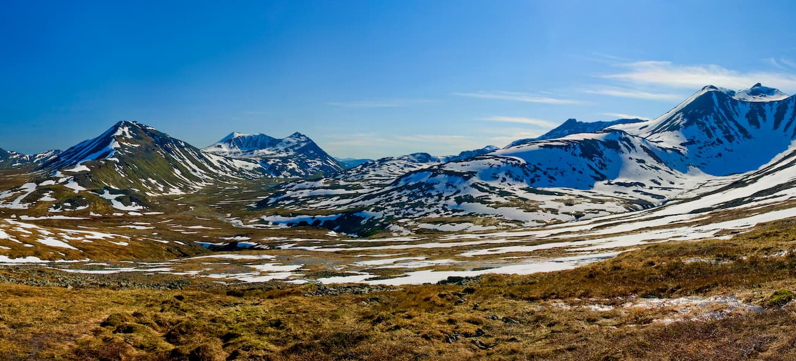
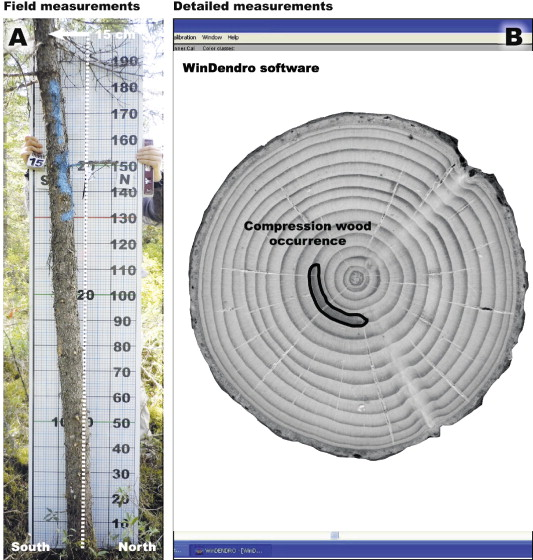

# **Atmospheric Science** {-#atmo}

Atmospheric science is the study of the dynamics and chemistry of the layers of gas that surround the Earth, other planets and moons. This encompasses the interactions between various parts of the atmosphere as well as interactions with the oceans and freshwater systems, the biosphere and human activities [(Nature Research)](https://www.nature.com/subjects/atmospheric-science). 

## Surface energy budgets in the Polar Urals of Russia {-#atmo-section}

*Landscape of Polar Ural mountains ([Source](https://peakvisor.com/range/ural-mountains.html))*

 

**The Data**

[Surface energy budgets in the Polar Urals of Russia, summer 2015-2017.](https://arcticdata.io/catalog/view/doi:10.18739/A2C824D80)

This dataset is brought to you by Valeriy Mazepa, Valeriy Ivanov, Stepan Shiyatov, and Aleksey Sheshukov. The Principal Investigator, [Valeriy Mazepa](https://cee.engin.umich.edu/people/valeriy-ivanov/) (he/him), is a hydrologist interested in how climate and topography affect water, energy, and vegetation dynamics in natural landscapes. Currently, he is a Professor at the University of Michigan, Ann Arbor.

The full paper associated with this dataset is avalible [here](https://agupubs.onlinelibrary.wiley.com/doi/abs/10.1029/2019JD030650).

**What we know**

According to [NOAA's Arctic Report Card](https://arctic.noaa.gov/Report-Card/Report-Card-2020/ArtMID/7975/ArticleID/878/Surface-Air-Temperature), the Arctic has been warming at an accelerating rate over the last decade, which is exacerbated by land-atmosphere-ocean feedback loops. In addition to that warming, a significant expansion of larch *forests* to moss-lichen and heath *tundra* areas (called the "greening" of the Arctic) over the past 50-60 years has been documented in western Siberia, with horizontal displacement (that is, the slantiness of the tree - see below photo from [Krause et al. 2013](https://doi.org/10.1016/j.foreco.2013.03.048)) rates of 32-58 meters per decade and altitudinal (height above sea level) rates of 3-4 meters per decade. These vegetation changes may have the potential to impact regional [hydrology](https://www.usgs.gov/special-topic/water-science-school/science/what-hydrology) and climate, as well as those feedbacks. We need to better understand these cycles in order to better model and predict Arctic warming, and as it stands (at least as of this paper's publication in 2019), we don't have enough field measurements from meteorological stations to quantify what's happening. Rather than focus on getting those field measurements, it's more efficient to use a model. This study wanted to confirm that the maximum entropy production (MEP) model would be accurate for predicting energy budgets in the Arctic across a range of vegetation gradients in Arctic permafrost landscapes.

 

**What we found out**

Growing season latent and sensible heat flux are nearly equal over the Arctic permafrost tundra regions. [″Sensible heat″ is ″sensed″ or felt in a process as a change in the land's temperature. ″Latent heat″ is energy transferred in a process without change of the land's temperature, for example, in a phase change (solid/liquid/gas).](https://en.wikipedia.org/wiki/Latent_heat#Usage) Persistent ground heat flux into the subsurface layer leads to seasonal thaw of the top permafrost layer. The Maximum Energy Production model described in this paper accurately estimates the latent, sensible, and ground heat flux of the surface energy budget of the Arctic permafrost regions.

**What's In The Data**

This dataset contains two .csv files for the tundra energy budget and for the tree energy budget. They both contain the same variables: datetime (summer), Net Radiation (W/sq m), Shortwave Down (W/sq m), Shortwave Up (W/sq m), Air Temperature (Celsius), Surface Skin Temperature (Celsius), Relative Humidity (decimal), Surface Specific Humidity (kg/kg), Wind Speed (m/s), SapflowSignal

## Atmospheric tracers for Arctic wildfires, air pollution, atmospheric chemistry, and climate change at GEOSummit, Greenland {-#section-two}

*The GEOSummit ([Source](https://www.geosummit.org/))*

 

**The Data**

[Atmospheric tracers for Arctic wildfires, air pollution, atmospheric chemistry, and climate change at GEOSummit, Greenland, since 2018.](https://arcticdata.io/catalog/view/urn%3Auuid%3A61c15d4d-5a8d-4ac7-82ae-7c1759b5b1ad)

This dataset is brought to you by Hélène Angot, Detlev Helmig, Jacques Hueber, Jashan Chopra, Connor Davel, and Christine Wiedinmyer. The Principal Investigator, [Christine Wiedinmyer](https://cires.colorado.edu/administration/christine-wiedinmyer) (she/her), is the Associate Director for Science at Cooperative Institute for Research in Environmental Sciences at the University of Colorado Boulder. Her research has focused on the emissions of trace gases and particles to the atmosphere and how these emissions impact atmospheric composition, air quality, and climate. She also investigates the effects of global change on these processes, such as how land cover and land use change alter the fluxes of trace gases to the atmosphere. 

**What we know**

There has been a major increase in Arctic wildfires in recent years [(Masrur et al. 2017)](https://doi.org/10.1088/1748-9326/aa9a76), and it's been suggested that these fires are increasing because the summers have been drier as a result of higher temperatures. This NSF-funded Arctic Observing Network [(AON)](https://www.nsf.gov/funding/pgm_summ.jsp?pims_id=503222) project focused on the study of Arctic tundra wildfires through continuous observations of atmospheric fire tracers (airborne gases that tell us information about the age of the fire and what material is being burned), including carbon monoxide, methane, and a series of volatile organic compounds (VOCs) monitored at the Greenland Environmental Observatory at Summit Station ([GEOSummit](https://www.geosummit.org/)), the only high altitude, high latitude, inland, year‐round observing station in the Arctic. These data will be used to understand the impacts that these wildfires are having, and will improve modeling efforts. 

**What the data is about**

This continually updating dataset is an archive of methane, carbon monoxide, carbon dioxide, and volatile organic compounds (ethane, propane, iso-butane, n-butane, acetylene, iso-pentane, n-pentane, n-hexane, benzene, toluene) in ambient air mixing ratios collected at GEOSummit since 2018, and updated regularly. These observations have been and will continue to be applied in modeling research to simulate Arctic wildfires, and to assess climate change-induced increases in Arctic wildfires and their feedback on the Arctic environment.

**What's In The Data**

This is a dataset that's updated frequently due to the requirements of the Arctic Observing Network. Four major variables of ambient air mixing ratios are tracked hourly:
-Methane (CH4) in 2018-2019 and 2020
-Carbon Monoxide (CO) in 2019 and 2020
-Carbon Dioxide (CO2) in 2019 and 2020
-Volatile organic compounds (VOCs; ethane, propane, iso-butane, n-butane, acetylene, iso-pentane, n-pentane, n-hexane, benzene, toluene) in 2018-2019