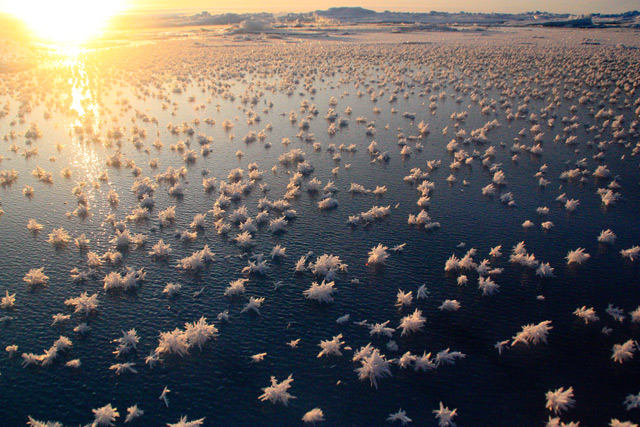

# Oceanography {-#flowers} 

The Arctic Ocean is, on average, the shallowest of Earth’s oceans. Its vast continental shelf areas, which account for approximately half of the Arctic Ocean’s total area, are heavily influenced by the surrounding land masses through river run-off and coastal erosion. As a main area of deep water formation, the Arctic is one of the main «engines» of global ocean circulation, due to large freshwater inputs, it is also strongly stratified. The Arctic Ocean’s complex oceanographic configuration is tightly linked to the atmosphere, the land, and the cryosphere. The physical dynamics not only drive important climate and global circulation patterns, but also control biogeochemical cycles and ecosystem dynamics. Current changes in Arctic sea-ice thickness and distribution, air and water temperatures, and water column stability are resulting in measurable shifts in the properties and functioning of the ocean and its ecosystems. The Arctic Ocean is forecast to shift to a seasonally ice-free ocean resulting in changes to physical, chemical, and biological processes. These include the exchange of gases across the atmosphere-ocean interface, the wind-driven ciruclation and mixing regimes, light and nutrient availability for primary production, food web dynamics, and export of material to the deep ocean. In anticipation of these changes, extending our knowledge of the present Arctic oceanography and these complex changes has never been more urgent. 

## Frost flowers on young Arctic sea ice {-#section}

**The Data**

[Frost flowers on young Arctic sea ice: The climatic, chemical and microbial significance of an emerging ice type](https://arcticdata.io/catalog/view/doi%3A10.18739%2FA2N036)

This dataset is brought to you by [ Jody W. Deming](https://www.ocean.washington.edu/story/Jody_Deming_Ecosystem) (she/her), an American oceanographer. She is a professor of Oceanography and a marine microbiologist at the University of Washington. Her research interests include studies of cold adapted microbes in their relation to astrobiology, biotechnology, and bioremediation.

The full paper associated with this dataset is avalible [here](https://agupubs.onlinelibrary.wiley.com/doi/full/10.1002/2014JD021736).

**What We Know**

Frost flowers are highly saline ice structures that grow on the surface of young sea ice, a spatially extensive environment of increasing importance in the Arctic Ocean. Although frost flower blooms are frequently observed in both polar oceans, little is understood about the physical, chemical and biological nature of these structures. To investigate their microbiology Bowman and Deming learned to grow frost flowers in a freezer lab at the University of Washington before moving their study into the field, collecting frost flowers during several challenging expeditions. With these first samples they have begun to develop the concept of frost flowers as a microbial habitat. Their goal is to probe the secrets of microbial life in very cold environments, a priority of the astrobiology community. Since many of the planets and moons in our solar system that might harbor life are very cold and covered in ice, determining the habitability of these planets and moons requires an understanding of the limits of life (as we know it) in the very coldest environments on Earth.

**What we found out**

Bowman and Deming have discovered that bacteria are consistently more abundant in frost flowers than in sea ice. Since microscopic pockets in sea ice are known to support an active community of psychrophiles (cold-loving microorganisms), even in the coldest months of the year, these results are encouraging. Frost flowers, however, are much colder than sea ice. In their last field season at Barrow, Alaska, working between intense blizzards blowing off the Beaufort Sea, they collected frost flowers and underlying sea ice for a comparative analysis of the life they host. Techniques designed to identify weakly respiring organisms are being employed in one of the coldest natural environments studied so far.

Finally, while frost flowers are too harsh an environment for most life, they may have ironically played a role in the origin of life on Earth. Formaldehyde, found in high concentrations in some frost flowers, is useful for making simple sugars including ribose. Ribose is an essential component of RNA, a molecule used to temporarily encode genetic information by every cell on Earth. Although today DNA is the primary molecule for passing on genetic information from one generation to the next, RNA may have been the first molecule to do so. On the early Earth frost flowers could have contributed ribose to a global “primordial soup” of molecules that allowed the first genetic system to form. Investigating this hypothesis is a particular challenge, as simple sugars are quickly consumed by ubiquitous and omnipresent microbes in today’s natural environment. To continue this line of research, Bowman and Deming are building a special chamber to grow frost flowers under ultra-clean conditions.

