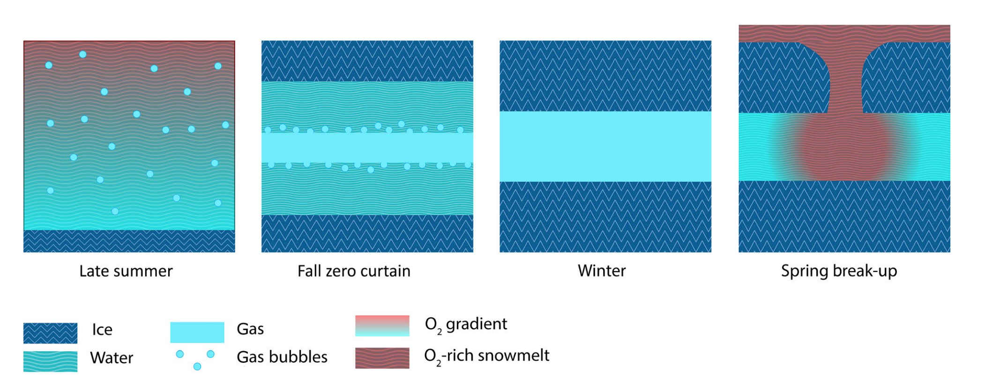

# **Permafrost** {-#perm}

In this section, datasets focus on the study of the Arctic permafrost. Permafrost is any type of ground — from soil to sediment to rock — that has been frozen continuously for a minimum of two years and as many as hundreds of thousands of years. Read more about this amazing phenomenon [here](https://www.nrdc.org/stories/permafrost-everything-you-need-know). 

## Thaw depth and water table in the footprint of five eddy covariance tower sites, Alaskan Arctic {-#section-perm}

*Brooks Range in Alaska ([Source](https://www.britannica.com/place/Brooks-Range))*

 

**The Data**

[Thaw depth and water table in the footprint of five eddy covariance tower sites, Alaskan Arctic, 2013-2017.](https://arcticdata.io/catalog/view/doi%3A10.18739%2FA26H4CQ8J)

This dataset is brought to you by Kyle Arndt, Donatella Zona, Walter Oechel, and Josh Hashemi. The Principal Investigator, [Donatella Zona](https://scholar.google.com/citations?user=Qw1L18EAAAAJ&hl=en) (she/her), a biologist with dual appointments at San Diego State University as an assistant professor of Biology and at the University of Sheffield (UK) as a senior research fellow. Her research interests include the impact of climate change on biodiversity, ecosystem functioning, and greenhouse gas emission in the Arctic.

The full paper associated with this dataset is avalible [here](https://doi.org/10.1111/gcb.15193).

**What We Know**

Tundra ecosystmes historically have been a net sink of carbon dioxide (CO2) but now, some sites are becoming net sources; and understanding these dynamics is increasingly important to the annual carbon balance of these vulnerable polar ecosystems [(Shaver et al, 1992)](https://doi.org/10.2307/1311862). Currently, the Arctic is responsible for about 3% of methane emissions, and most likely that percentage will increase with climate change. When the permafrost warms, gas releases from the frozen soils, which offsets almost half of the summer uptake of CO2 that happens from the photosynthesizing plants. It's important to understand what the microbial community is doing in response to changing conditions so that we can understand what drives large carbon dioxide and methane emissions - for example, some bacteria are methanogens (which means they release methane) and others release carbon dioxide, so knowing how the community changes tells us how the greenhouse gases may change. The goal of this study was to understand the permafrost redox state (ie, the balance of decomoposition chemical reactions) using pore water samples, soil cores, and edd covariance tower carbon fluxes.

**What we found out**

The researchers analyzed freeze–thaw processes through in situ CO2 and CH4 fluxes in conjunction with soil cores for physical structure and porewater samples for redox biogeochemistry [(for more information about redox biogeochemical processes, see Borch et al. 2009)](https://doi.org/10.1021/es9026248). In those soil cores, Dr. Zona's team found that water moves toward freezing fronts in soil cores, which leaves air pockets in soils. Those air pockets means that oxygen‐rich snow melt in spring can trickle down into the pockets and provide the bacterial community with the oxygen they need to perform cellular respiration. Without that meltwater and the oxygen contained within it, bacteria are only able to break down compounds via anaeobic pathways (without oxygen) or methane-generating pathways. With warming projected to increase in the future, the snow melt period will likely increase as well, giving more time for these net carbon source conditions to persist.

*Figure 6 from Arndt et al. 2020: a schematic showing what the permafrost soils look like in terms of ice, water, and gas.*

 

**What's In The Data**

This dataset has four variables: 

- date
- thaw_depth: depth of thaw measured from the soil surface in centimeters. Negative values are used to indicate depth below the surface
- water_table: Height of the water table in centimeters measured from the soil surface. Negative values indicate distance below the soil surface, and positive values indicate distance above the soil surface
- site