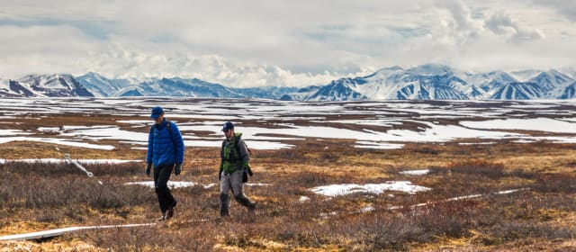
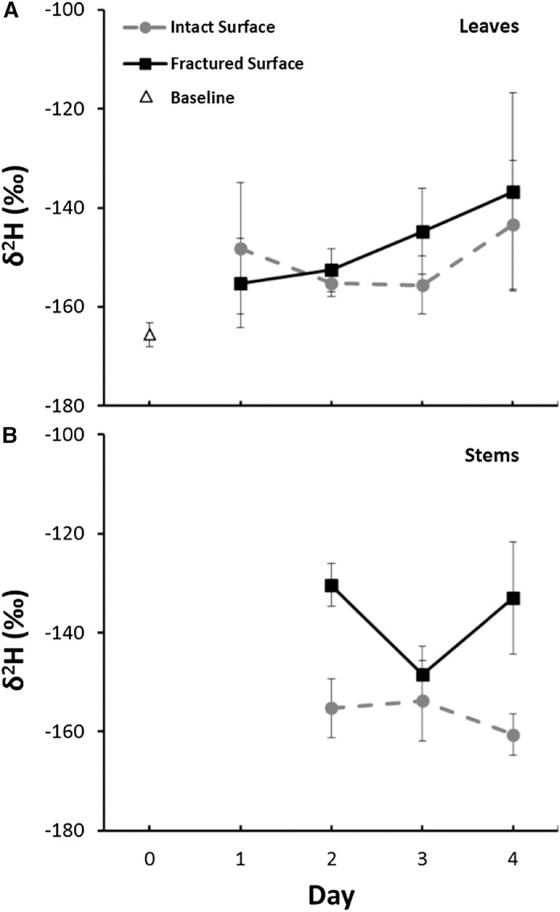
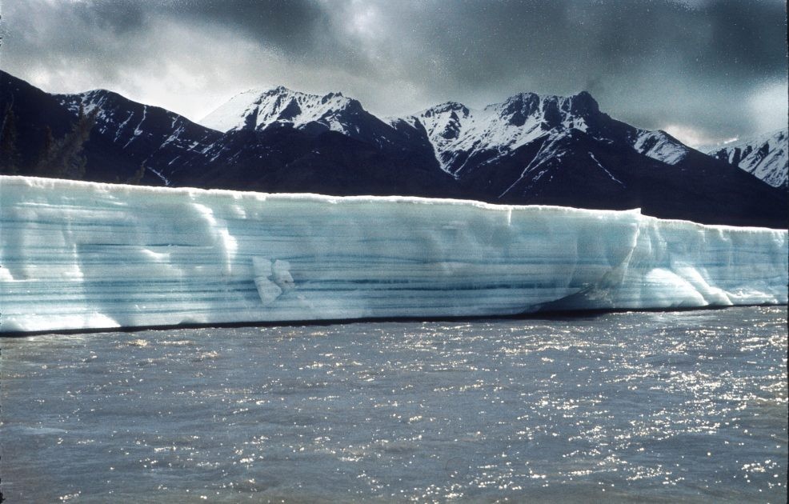
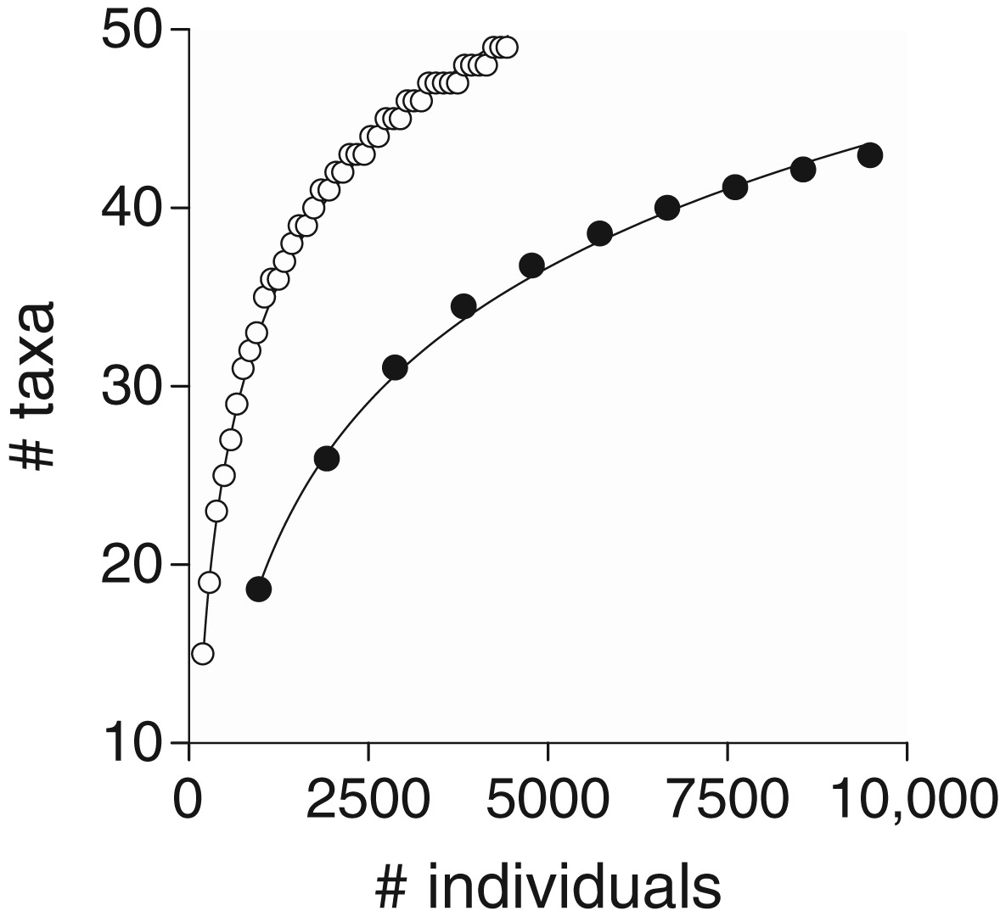

# **Ecology** {-#ecology} 

The following datasets are ecology focused. Ecology is the study of how organisms interact with one another and with their physical environment. The distribution and abundance of organisms on Earth is shaped by both biotic - living organism-related - and abiotic - nonliving or physical - factors. Ecology is studied at many levels, including organism (one creature), population (a group of creatures of the same type), community (a few populations), ecosystem (the interaction of most communities in a region), and biosphere (across the whole planet). Read more about the study of ecology [here](https://www.khanacademy.org/science/biology/ecology/intro-to-ecology/a/what-is-ecology).

## Labeling study of water use by tundra evergreens in the winter spring transition {-#this-section}

*Co-PI Steve Oberbauer at Toolik Field Station — one of the world’s most remote research sites, hundreds of miles above the Arctic circle. ([Source](https://communitynewspapers.com/florida-international-university/were-better-off-if-things-stay-frozen-says-fiu-arctic-researcher/))*

 

**The Data**

[Labeling study of water use by tundra evergreens in the winter spring transition.](https://arcticdata.io/catalog/view/doi%3A10.18739%2FA22V2CB1P)

This dataset is brought to you by [Steven F. Oberbauer](http://faculty.fiu.edu/~oberbaue/), Jonathan Moser, Gregory Starr, and Behzad Mortazavi. Steven Oberbauer (he/him) is a Professor and the Chairperson of the Biological Sciences Department at Florida International University. His research interests include plant and ecosystem physiology, energy balance, plant phenology and productivity of vascular plants and bryophytes, particularly in response to climate change.

The full paper associated with this dataset is avalible [here](https://bsapubs.onlinelibrary.wiley.com/doi/full/10.3732/ajb.1500358).

**What We Know**

We learn in school that photosynthesis is the process by which plants make glucose (energy) from the sun. The assumption there is that plants can only do that when it's sunny out, but that's not true - in fact, evergreen plants can phtosynthesize at any time of the year, including winter, if conditions are favorable. Evergreen plants (like pines) in the Arctic can even do so when their leaves are covered in snow, which may help them offset cellular respiration carbon loss that happens in the winter. That said, the plants still need water to photosynthesize, and it's unclear at this time how the plants obtain the water from the frozen soil. This study wanted to find out how that happens, so they enriched meltwater with a hydrogen isotope to see if plants were rehydrating during the winter via their roots or via their leaves.

**What we found out**

Based on the results of these experiments, it seems like evergreen tundra plants do take up water under snow cover both via roots and leaves. The results from the community of plants as well as on the individual plant level confirm that there was more of the enriched hydrogen in the plant than the baseline enriched hydrogen in the ground on all of the sampling days (Figure 1).
 

*Figure 1 from Moser et al. 2016: Enriched hydrogen (y axis) increased in leaves and stems relative to the baseline (triangle symbol). ([Source](https://doi.org/10.3732/ajb.1500358): Moser, J. G., Oberbauer, S. F., Sternberg, L. D. S., Ellsworth, P. Z., Starr, G., Mortazavi, B., & Olivas, P. C. (2016). Water uptake of Alaskan tundra evergreens during the winter–spring transition. American journal of botany, 103(2), 298-306.*

 
 

Disturbing the soil increased uptake of the tracer water, since that would fracture the top ice layer and let more water into the soil pores. These evergreen plants have likely adapted to uptake water in the winter to offset their carbon losses due to respiration - tundra plants are small, and don't have the large storage capacity of more southern trees.

**What's in the Data**

This dataset has 3 raw data files associated with it, plus the metadata, that all have the same attributes: Study location, coordinates, date, species, treatment (control or labeled), day of experiment, change in the 2H content (in parts per thousand), and the plant community. Additionally, there is a column for comments.

## Effects of aufeis on the structure and function of Arctic river-floodplain ecosystems, Alaska {-#my-section}

*Aufeis on Alaskan River ([Source](https://www.alaska.org/advice/aufeis-on-the-alaskan-rivers))*

**The Data**

[Effects of aufeis on the structure and function of Arctic river-floodplain ecosystems, Alaska, 2016-2017.](https://arcticdata.io/catalog/view/doi:10.18739/A20P0WR15)

This dataset is brought to you by Michael Gooseff and Alex Huryn. [Michael Gooseff](http://goosefflab.weebly.com/about-me--cv.html) (he/him) is a Professor in the Institute of Arctic and Alpine Research (INSTAAR) and in the Department of Civil Architectural & Environmental Engineering at the University of Colorado.  He is currently the Lead Principal Investigator of the McMurdo Dry Valleys LTER project and the Co-Director of the Hydrologic Sciences Graduate Program at CU. Dr. Gooseff conducts ongoing research in Arctic Alaska, mostly from Toolik Field Station, and also conducts research in Antarctica. 

The paper associated with this dataset is avalible [here](https://aslopubs.onlinelibrary.wiley.com/doi/full/10.1002/lno.11626). Additionally, this project has a webpage; check out the research webpage [here](http://goosefflab.weebly.com/arctic-oases---aufeis-influence-on-arctic-river-ecosystems.html).

**What We Know**

[Aufeis](https://www.polartrec.com/expeditions/microbial-changes-in-arctic-freshwater-2016/journals/2016-06-20) (German for "ice on top") is a collection of massive accumulations of ice that are common to many Arctic rivers. It forms during freeze-up when thickening surface ice on the river causes local overflows. Successive cycles of overflow result in accumulations of enormous volumes of ice, with aufeis on some Alaskan rivers attaining thicknesses of 3-5 meters (9-15 feet), covering more than 20 square kilometers (7.72 square miles), and storing as much as 30% of the annual river discharge. 

Although aufeis has been studied by hydrologists and is known to be required for winter and spawning habitat for some fish, understanding of their ecology is poor.

**What we found out**

The Kuparuk aufeis field provides subsurface habitat for a rich assemblage of freshwater invertebrates, which are distinct from those that live in surface level habitats. This level of richness is presumably enabled by the relatively high porosity of the subsurface sediments combined with a high level of connectivity between pore spaces. To our knowledge, this is the first demonstration of a groundwater (e.g., hyporheic/parafluvial/groundwater) invertebrate fauna in a region of continuous permafrost.

 

{width="50%"}

*Rarefaction curves for invertebrates sampled from aufeis wells (closed circles) and surface sediments (open circles). The mean cumulative number of taxa per number of samples is plotted as a function of accumulated number of individuals sampled.*

*Note: In ecology, [rarefaction](https://en.wikipedia.org/wiki/Rarefaction_(ecology)) is a technique to assess species richness from the results of sampling. Rarefaction allows the calculation of species richness for a given number of individual samples based on the construction of so-called rarefaction curves. This curve is a plot of the number of species as a function of the number of samples. Rarefaction curves generally grow rapidly at first, as the most common species are found, but the curves plateau as only the rarest species remain to be sampled.*
