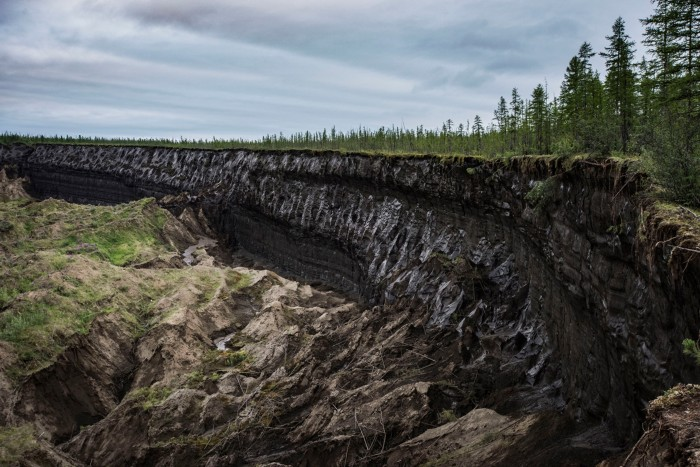

# **Soil Science** {-#soil} 

Soil science is the science dealing with soils as a natural resource on the surface of the Earth including soil formation, classification, and mapping; physical, chemical, biological, and fertility properties of soils; and these properties in relation to the use and management of the soils. Dataset(s) will help you explore Arctic soil science. S

##  Soil respiration, water chemistry, and soil gas data for thermokarst features and undisturbed tundra on the North Slope of Alaska {-#new-section}

*Photo credit: Yuri Kozyrev/NOOR/eyevine*
 

 

**The Data**

[Labeling study of water use by tundra evergreens in the winter spring transition](https://arcticdata.io/catalog/view/doi%3A10.18739%2FA22V2CB1P)

This dataset is brought to you by [Ben Abbott](https://pws.byu.edu/ben-abbott-lab/about-ben-abbott) (he/him), an Assistant Professor of Ecosystem Ecology at Brigham Young Universityy. Ben works primarily on the permafrost climate feedback and water quality in river networks. Drawing on biogeochemistry, evolutionary biology, and social science, his research investigates how the co-evolution of landscapes and ecosystems results in broad-scale patterns of biological, hydrological, and socioeconomic behavior. Specifically, he studies how permafrost collapse, agriculture, fire, and flooding affect carbon and nutrient cycles in soil, groundwater, rivers, and lakes.

The full paper associated with this dataset is avalible [here](https://onlinelibrary.wiley.com/doi/abs/10.1111/gcb.13069).

**What We Know**

Release of greenhouse gases from thawing permafrost is potentially the largest terrestrial feedback to climate change and one of the most likely to occur; however, estimates of its strength vary by a factor of thirty. Some of this uncertainty stems from abrupt thaw processes known as thermokarst (permafrost collapse due to ground ice melt), which alter controls on carbon and nitrogen cycling and expose organic matter from meters below the surface. Thermokarst may affect 20–50% of tundra uplands by the end of the century; however, little is known about the effect of different thermokarst morphologies on carbon and nitrogen release. 

**What we found out**

After measuring soil organic matter displacement, ecosystem respiration, and soil gas concentrations at 26 upland thermokarst features on the North Slope of Alaska, the researchers found that thermokarst morphology interacted with landscape parameters to determine both the initial displacement of organic matter and subsequent carbon and nitrogen cycling. The large proportion of ecosystem carbon exported off‐site by slumps and slides resulted in decreased ecosystem respiration postfailure, while gullies removed a smaller portion of ecosystem carbon but strongly increased respiration and N2O concentration. Elevated N2O in gully soils persisted through most of the growing season, indicating sustained nitrification and denitrification in disturbed soils, representing a potential noncarbon permafrost climate feedback. While upland thermokarst formation did not substantially alter redox conditions within features, it redistributed organic matter into both oxic and anoxic environments. Across morphologies, residual organic matter cover, and predisturbance respiration explained 83% of the variation in respiration response. Consistent differences between upland thermokarst types may contribute to the incorporation of this nonlinear process into projections of carbon and nitrogen release from degrading permafrost.