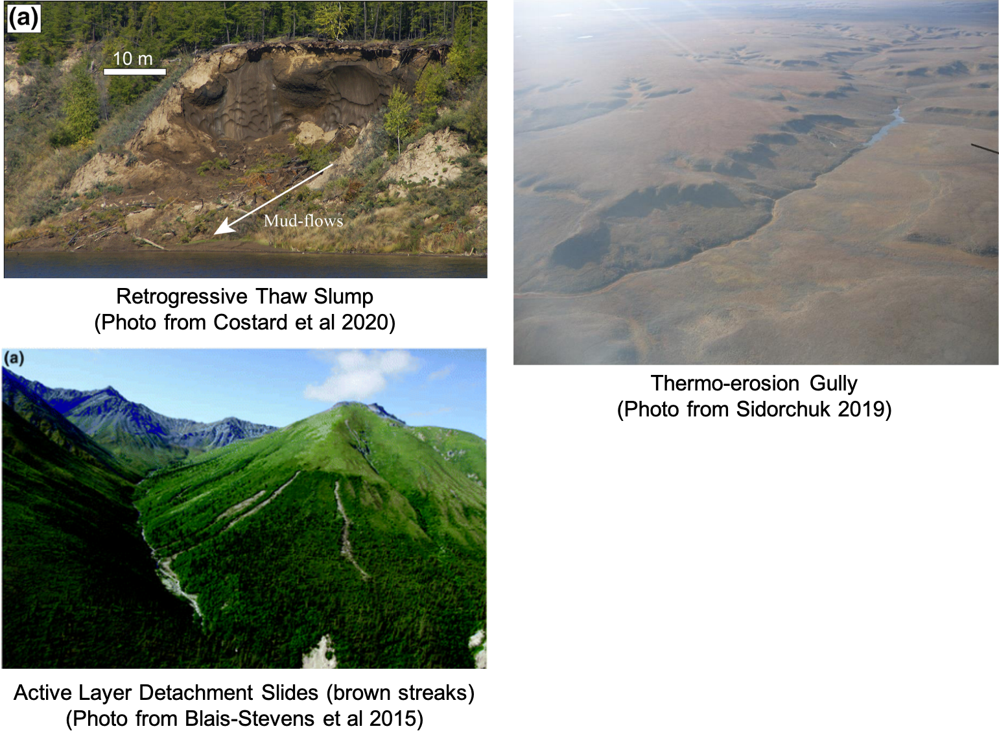
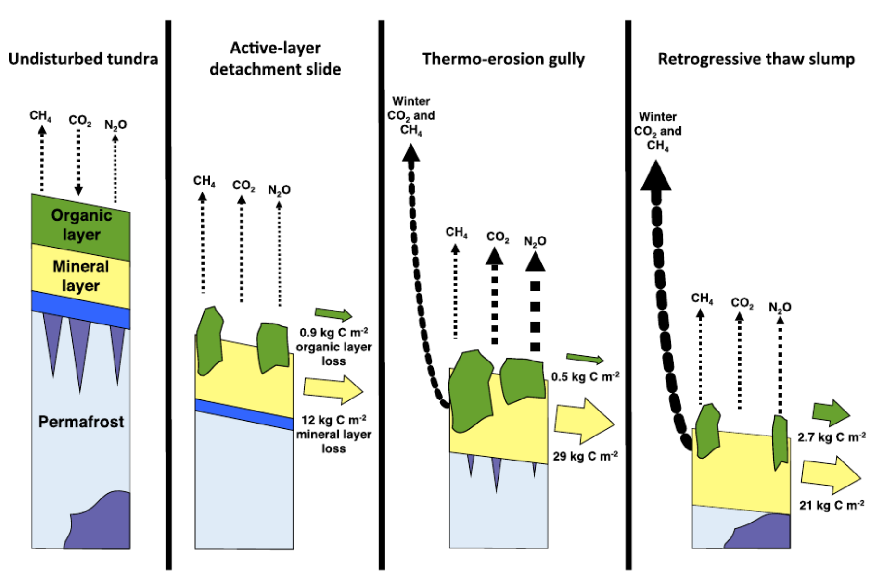

# **Soil Science** {-#soil} 

Soil science is the study of soils as a natural resource on the surface of the Earth including soil formation, classification, and mapping; physical, chemical, biological, and fertility properties of soils; and these properties in relation to the use and management of the soils. These datasets will help you specifically explore soil science in the Arctic.

##  Soil respiration, water chemistry, and soil gas data for thermokarst features and undisturbed tundra on the North Slope of Alaska {-#new-section}

*Photo credit: Yuri Kozyrev/NOOR/eyevine*
 

 

**The Data**

[Soil respiration, water chemistry, and soil gas data for thermokarst features and undisturbed tundra on the North Slope of Alaska.](https://doi.org/10.18739/A23T9D71C)

This dataset is brought to you by [Ben Abbott](https://pws.byu.edu/ben-abbott-lab/about-ben-abbott) (he/him), an Assistant Professor of Ecosystem Ecology at Brigham Young University. Ben works primarily on the permafrost climate feedback and water quality in river networks. Drawing on biogeochemistry, evolutionary biology, and social science, his research investigates how the co-evolution of landscapes and ecosystems results in broad-scale patterns of biological, hydrological, and socioeconomic behavior. Specifically, he studies how permafrost collapse, agriculture, fire, and flooding affect carbon and nutrient cycles in soil, groundwater, rivers, and lakes.

The full paper associated with this dataset is avalible [here](https://onlinelibrary.wiley.com/doi/abs/10.1111/gcb.13069).

**What We Know**

In cold environments, decomposition of organic material is often limited due to temperatures. There isn't as much organic matter being broken down by microbes, so that leads to a build up of organic matter in the soil. Normally, that doesn't cause any problems for the ecosystem, and the carbon and nitrogen cycles are "used" to the status quo. However, the build up of soil organic matter (SOM) can be an issue when global warming enters the mix. As the climate warms, the soil is no longer too cold for decomposition - which means the carbon stored in that permafrost may release. Permafrost contains more than half of the world's soil organic matter, so this is no small scale concern. Increases in [thermokarst](https://www.britannica.com/science/thermokarst) (permafrost collapse due to ground ice melt) exposes that SOM, and based on some warming projections, thermokarst could affect 20-50% of upland areas by the end of the century. There are three morpologies (or, shapes) of thermokarst that are common: retrogressive thaw slumps, active layer detachment slides, and thermo-erosion gullies. The researchers here investigated whether or not the type of thermokarst affected the carbon and nitrogen release of the newly exposed soils.

*Photo references: [Costard et al 2020](https://doi.org/10.1029/2020GL091070), [Blais-Stevens et al 2015](https://doi.org/10.1007/978-3-319-09300-0_86), and [Sidorchuk 2019](https://doi.org/10.3390/su12010260).*
 

 

**What we found out**

After measuring soil organic matter displacement, ecosystem respiration (ie, all photosynthesis and cellular respiration processes happening by all organisms), and soil gas concentrations (methane CH4, carbon dioxide CO2, and nitrous oxide N2O) at 26 upland thermokarst spots on the North Slope of Alaska, the researchers found that the shape of the thermokarst feature does impact the nutrient cycles and soil organic matter degradation. Because slumps and slides move a large amount of carbon material somewhere else, the ecosystem respiration was LESS after the thermokarst feature was formed. Gullies, on the other hand, largely kept the carbon local but increased ecosystem respiration and concentration of nitrous oxide. The increase in nitrous oxide was interesting - the concentration stayed high through most of the summer, which suggests that there was more [nitrification and denitrification](https://www.nature.com/scitable/knowledge/library/the-nitrogen-cycle-processes-players-and-human-15644632) happening in these soils. Usually permafrost thaw is associated with carbon, so the impact on the nitrogen cycle represents a new possible climate impact, given that gulliesm ake up over half of all thermokarst and N2O has a global warming potential that is 300x that of CO2. This work is key to including thermokarst in climate models so that we're accurately predicting carbon and nitrogen release from thawing permafrost.

*Figure 10 from Abbott & Jones 2015 - a conceptual model of the three thermokarst morphologies and their effects on the carbon and nitrogen cycles.*

**What's in the Data**

This is a dataset with a LOT of datasets (23 nested datasets in total). Overall it contains soil respiration, water chemistry, and soil gas data for thermokarst and reference tundra sites on the North Slope of Alaska. Explore!
