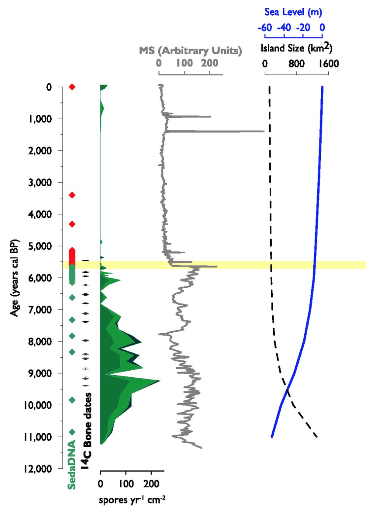

# **Paleontology/Paleoecology** {-#paleo}

The following dataset(s) are "paleo-" focused. "Paleo-" is a latin prefix meaning “old” or “ancient,” especially in reference to former geologic time periods. This section will feature datasets from the paleontology and paleoecology branches of science.

Paleontology is the study of the history of life on Earth as based on fossils. Fossils are the remains of plants, animals, fungi, bacteria, and single-celled living things that have been replaced by rock material or impressions of organisms preserved in rock.

Paleoecology is the study of interactions between once-living organisms and their environmental surroundings. Interactions between organisms can take a variety of forms, including competition between similar organisms for resources, predation of one organism by another, and symbiosis between different organisms to enable each organism to survive and reproduce. Read more [here](https://www.digitalatlasofancientlife.org/learn/paleoecology/).

## Using sediment core data to better understand the woolly mammoth extinction {-#paleo-section}

 

**The Data**

[Sediment core data related to the extinction of Mammuthus primigenius, St. Paul Island, Alaska, 2014.](https://arcticdata.io/catalog/view/doi%3A10.18739%2FA24746R6K)

This dataset is brought to you by [Matthew Wooller](https://www.uaf.edu/cfos/people/faculty/detail/matthew-wooller.php) (he/him), an interdisciplinary scientist who works on applying stable isotope techniques to understand the influence of changing environmental conditions on past and present ecosystems. Isotopes (of C,N,O,H and Sr) feature as the primary analytical tools that Dr. Wooller uses to study a wide range of environmental and ecological questions. 

The full paper associated with this dataset is available [here](https://www.pnas.org/content/113/33/9310).

**What We Know**

Even though most mainland woolly mammoth (Mammuthus primigenius) populations went extinct on mainland North America around 14,000 years ago, some populations survived on several small [Beringian](https://www.nps.gov/articles/aps-v12-i2-c8.htm) islands for thousands of years later. Specifically, woolly mammoth populations on St. Paul Island were likely alive until about 6,000 years ago. Normally, extinction happens because of environmental change, human impacts, or a combination of both. But, St. Paul Island wasn't populated by humans until the 1700s, so these researchers were able to study when and why these mammals went extinct specifically from environmental change. The prevailing hypotheses as to why these animals died out were that there was a change in vegetation or an increase in snowpack; these authors used sediment core proxy methods and radio carbon dating of 14 newly discovered mammoth remains to better understand what happened.

**What we found out**

The authors were able to pretty precisely pinpoint when the extinction happened: 5,600 +- 100 years ago. All five of the independent indicators that the team measured (sedimentary ancient DNA, 3 different fungi, and the radio carbon dating) agreed, and this study is the most robust and precise estimate of an extinction ever recorded.

*Photo credit: Graham et al. 2016 Figure 2. Caption from the paper: Timing of woolly mammoth extinction on St. Paul. Five indicators are plotted against time (calendar years before 1950 CE): sedimentary ancient DNA (sedaDNA; green and red circles indicate inferred presence and absence, respectively), direct AMS radiocarbon dates on mammoth remains (black crosses), and spore accumulation rates for the coprophilous fungi Sporormiella (medium green, bottom of stack), Sordaria (light green, middle), and Podospora (dark green, top) (spores yr-1 cm-2). Magnetic susceptibility, in arbitrary units (AU) of Lake Hill sediments, sea level (m), and St. Paul Island area (km2) are shown for comparison. Note the truncation by plot of highest peak of magnetic susceptibility at 1,500 AU. The yellow band indicates inferred timing of extinction at 5,600 ± 100 y ago. Magnetic susceptibility is a measure of sediment characteristics; its rapid decline indicates a rapid reduction in watershed erosion at the same time as the extinction.*
 

 

The major drivers behind this extinction were all related to freshwater availability on the island: lake shallowing, increased water turbidity, and increased salinity. Without fresh water, of course, mammoths would be unable to survive. Understanding why the freshwater decreased is a more difficult endeavor, and the authors hypothesized that it was related to sea level rise, climate change, and overuse of the freshwater resource by the mammoths.

The St. Paul mammoth demise is now one of the best-dated prehistoric extinctions, highlighting freshwater limitation as an overlooked extinction driver and underscoring the vulnerability of small island populations to environmental change, even in the absence of human influence.

 

 
{width="70%"}

 

*Paleoenvironmental proxies at Lake Hill, plotted against time. Shown are relative abundances of planktonic (blue bars), tychoplanktonic (maroon bars), and high-conductivity–tolerant diatoms (orange bars); ratio of pelagic and littoral cladocerans (gray curve); relative abundance (%) of cladoceran Alona circumfibriata, which is tolerant of high lake water conductivity (purple bars); δ18O values from aquatic invertebrate chitin (blue curve); δ15N values from mammoth collagen (red curve); sediment magnetic susceptibility (in AU); and accumulation rates for herb and shrub pollen types (light green and tan curves, respectively). The estimated timing of extinction is indicated by the yellow vertical bar (Graham et al. 2016).*

 