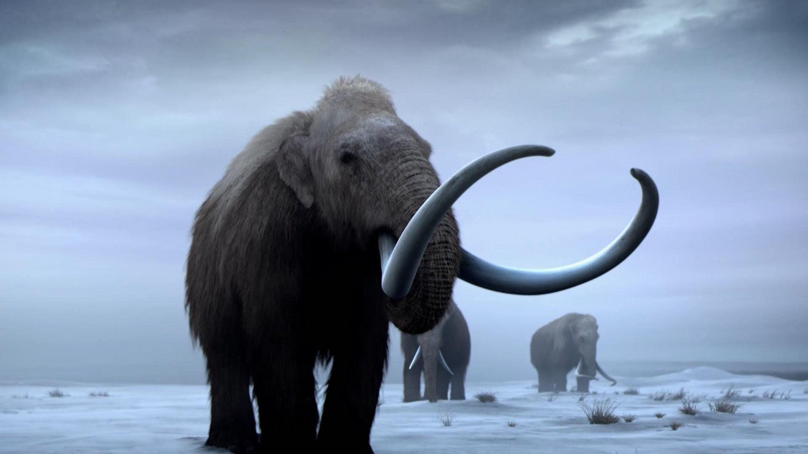
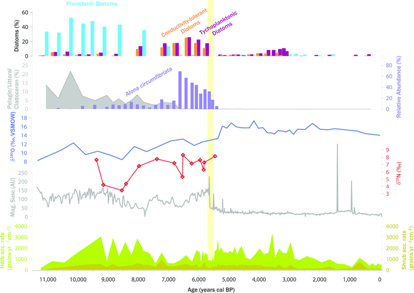

# **Paleontology/Paleoecology** {-#paleo}

The following dataset(s) are "paleo-" focused. "Paleo-" is a latin prefix meaning “old” or “ancient,” especially in reference to former geologic time periods. This section will feature datasets from the paleontology and paleoecology branches of science.

Paleontology is the study of the history of life on Earth as based on fossils. Fossils are the remains of plants, animals, fungi, bacteria, and single-celled living things that have been replaced by rock material or impressions of organisms preserved in rock.

Paleoecology is the study of interactions between once-living organisms and their environmental surroundings. Interactions between organisms can take a variety of forms, including competition between similar organisms for resources, predation of one organism by another, and symbiosis between different organisms to enable each organism to survive and reproduce. Read more [here](https://www.digitalatlasofancientlife.org/learn/paleoecology/).

## Using sediment core data to better understand the wooly mammoth extinction {-#my-section}

 

**The Data**

[Sediment core data related to the extinction of Mammuthus primigenius, St. Paul Island, Alaska, 2014.](https://arcticdata.io/catalog/view/doi%3A10.18739%2FA24746R6K)

This dataset is brought to you by [Matthew Wooller](https://www.uaf.edu/cfos/people/faculty/detail/matthew-wooller.php) (he/him/his), an interdisciplinary scientist, applying stable isotope techniques to understand the influence of changing environmental conditions on past and present ecosystems.

The full paper associated with this dataset is avalible [here](https://www.pnas.org/content/113/33/9310).

**What We Know**

Relict woolly mammoth (Mammuthus primigenius) populations survived on several small Beringian islands for thousands of years after mainland populations went extinct.

Five independent indicators of extinction show that mammoths survived on St. Paul until 5,600 ± 100 years ago. Vegetation composition remained stable during the extinction window, and there is *no evidence* of human presence on the island before 1787 CE, suggesting tha=t these factors were not extinction drivers. 

**What we found out**

Instead, the extinction coincided with declining freshwater resources and drier climates between 7,850 and 5,600 years ago, as inferred from sedimen-tary magnetic susceptibility, oxygen isotopes, and diatom and cla-doceran assemblages in a sediment core from a freshwater lake on the island, and stable nitrogen isotopes from mammoth remains. 

Contrary to other extinction models for the St. Paul mammoth population , this evidence indicates that this mammoth population died out because of the synergistic effects of shrinking island area and freshwater scarcity caused by rising sea levels and regional climate change. Degradation of water quality by intensified mammoth activity around the lake likely exacerbated the situation. The St. Paul mammoth demise is now one of the best-dated prehistoric extinctions, highlighting freshwater limitation as an overlooked extinction driver and underscoring the vulnerability of small island populations to environmental change, even in the absence of human influence.

 

 
{width="70%"}

 

*Paleoenvironmental proxies at Lake Hill, plotted against time. (View the paper for the full caption.)*

 