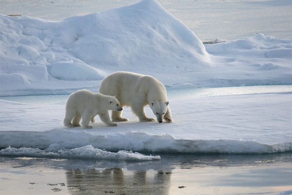

# **Biology** {-#bio} 

Below, you'll find datasets from the field of biology. Biology is the study of living organisms, divided into many specialized fields that cover their morphology, physiology, anatomy, behavior, origin, and distribution.

## Adaptive long-term fasting in land and ice-bound polar bears {-#section-bears}

*Photo by Martha de Jong-Lantink on Flickr.*

**The Data**

There are *eight* datasets associated with this project: 

* [Adaptive long-term fasting in land and ice-bound polar bears: Data Table.](https://arcticdata.io/catalog/view/doi%3A10.18739%2FA2Z35S)
* [Polar Bears: Morphological measurements and body condition at capture.](https://arcticdata.io/catalog/view/doi%3A10.5065%2FD60V89XD)
* [Polar Bears: Location and movements.](https://arcticdata.io/catalog/view/doi%3A10.5065%2FD6K072D2)
* [Polar Bears: Body temperature.](https://arcticdata.io/catalog/view/doi%3A10.5065%2FD6T43R6P)
* [Polar Bears: Blood analyses.](https://arcticdata.io/catalog/view/doi%3A10.5065%2FD61N7Z8M)
* [Polar Bears: Adipose analyses.](https://arcticdata.io/catalog/view/doi%3A10.5065%2FD6H41PJS)
* [Polar Bears: Muscle analyses.](https://arcticdata.io/catalog/view/doi%3A10.5065%2FD6RR1WDV)
* [Polar Bears: Breath analyses.](https://arcticdata.io/catalog/view/doi%3A10.5065%2FD6HD7SS6)

These datasets are brought to you by Henry J. Harlow, Merav Ben-David, John P. Whiteman, and George M. Durner. Henry J. "Hank" Harlow, Co-Principal Investigator, is a Professor at the University of Wyoming and the Director of the National Park Service Research Center. Merav Ben-David is an Israeli-American ecologist, zoologist, and politician who is the Chair of the Department of Zoology and Physiology at the University of Wyoming.

There are two journal articles associated: 

1. [Polar bears experience skeletal muscle atrophy in response to food deprivation and reduced activity in winter and summer](https://academic.oup.com/conphys/article/5/1/cox049/4079877)
2. [Phenotypic plasticity and climate change: can polar bears respond to longer Arctic summers with an adaptive fast?](Phenotypic plasticity and climate change: can polar bears respond to longer Arctic summers with an adaptive fast?)

**What We Know**

When reducing activity and using stored energy during seasonal food shortages, animals risk degradation of skeletal muscles, although some species avoid or minimize the resulting atrophy while experiencing these conditions during hibernation. Polar bears may be food deprived and relatively inactive during winter (when pregnant females hibernate and hunting success declines for other demographic groups) as well as summer (when sea ice retreats from key foraging habitats). 

**What we found out**

After capturing 57 adult female polar bears to assess their body condition and measure blood variables that indicate feeding, regular fasting, and adaptive fasting, we found that bears on shore maintained lipid and protein stores by scavenging on bowhead whale carcasses from human harvest, while those that followed the retreating sea ice beyond the continental shelf were food deprived.
