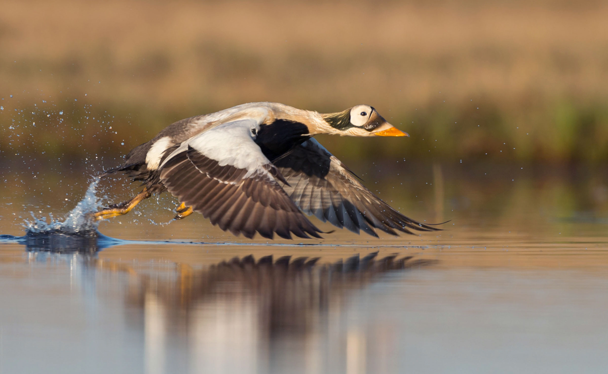

# **Environmental Management** {-#mangement}

The dataset featured in this section focuses on environmental management. Environmental management is concerned with the understanding of the structure and function of the earth system, as well as of the ways in which humans relate to their environment. Environmental management is therefore concerned with the description and monitoring of environmental changes, with predicting future changes and with attempts to maximize human benefit and to minimize environmental degradation due to human activities. Read more from the SOAS University of London [here](https://www.soas.ac.uk/cedep-demos/000_P500_ESM_K3736-Demo/unit1/page_10.htm). 

##  Sustaining ecological and subsistence functions in conservation areas: eider habitat and access by Native hunters along landfast ice, Alaska {-#section-eider}

*King Eider [(Source)](https://animals.net/king-eider/)*

**The Data**

[ Sustaining ecological and subsistence functions in conservation areas: eider habitat and access by Native hunters along landfast ice, Alaska, 1997-2011.](https://arcticdata.io/catalog/view/doi%3A10.18739%2FA28C9R436)

This dataset is brought to you by Aariel Rocha, James Lovvorn, Andrew Mahoney, and Stephen Jewett. The Principal Investigator [James Lovvorn](https://zoology.siu.edu/faculty-staff/faculty/current-faculty/lovvorn-j.php) (he/him) is a Professor at Southern Illinois University. His research group seeks to understand linkages between mobile top predators (birds) and aquatic food webs.

The full paper associated with this dataset is avalible [here](https://doi.org/10.1017/S0376892918000103).

**What We Know**

When populations and habitats are vulnerable to climate change, efforts are often made to set up "safe spaces" for breeding populations so that they have space and the environment to recover. The Arctic, though, is more complicated than other environments - in addition to Arctic amplification, which means that climate change is accelerating faster in these regions, the Arctic is also home to Indigenous peoples who hunt as part of their way of life. Hunting for the Inupiat of Arctic Alaska and the Inuit farther northeast in Canada is about more than just getting enough food to survive - it's also about promoting social traditions, caring for the weaker community members, and transferring culture across generations. Populations of animals like walruses, seals, and eiders (a kind of bird) are all part of subsistence hunting traditions but are also responding to climate changes - how do we protect these animals but also protect Indigenous access as well?

Climate change is having a substantial affect on Arctic ice, which is making hunting these traditional animals less predictable - and more dangerous - for Indigenous communities. Management decisions that affect these species have to also include maintaining healthy and resilient Native communities.

This particular research is using the eiders as an example for how to do that. The researchers investigate where the eiders are feeding (places on the ice where there are major densities of eider prey) and where the landfast ice edge (where the ice is still safe for Indigenous hunters to stand on to hunt eiders) is - the intersection of those two areas should be where conservation efforts are concentrated.

**What We Found Out**

Over the 15 years of data collection, the edge of the landfast ice was more or less in the same spot. The coastline of Skull Bay provides both good habitat for the eiders and hunting access to them - but the overlap of those two regions (of good feeding grounds and good hunting grounds) is small: an average of 4.2% of the total habitat area in Skull Bay, 1.3% in the Waiwirght segment, and 0.7% in the Ledyard Bay segment, and 0% (no overlap) in the Point Hope segment. These areas of overlap would be good to designate as "high priority subsistence conservation areas" to protect both the populations and Indigenous access to them.

However, these locations are not fixed in time, and so keeping up with what areas are these high priority subsistence conservation areas would require upkeep. Summertime warming, which leads to a shrinking polar ice cap, is changing the landfast ice slowly and causing ice free conditions to move earlier in the year. Changing winds also have an effect on the locations of these feeding areas and whether hunters can access them. 

*Figure 3 from Lovvorn et al 2018 - showing how often feeding grounds for eiders and places where Indigenous communities can hunt those eiders overlap. Over 1997-2011, the maximum number of years those areas overlapped was 9 years.*

Environmental management decisions are sometimes viewed negatively by Native communities, since historically, there hasn't been local control over what areas are managed and how. Considering both the needs of the human communities as well as the animal communities is essential for conservation planning moving forward.

**What's In The Data**

Overlap_SLIE_Viable_Area_gdb.rar - The area denoting overlap between Seaward Landfast Ice Edge (SLIE) range (from Range_Min_Max_gdb.rar) and viable habitat (from ViableArea.rar)
Range_Min_Max_gdb.rar - The area between minimum and maximum seaward landfast ice edge for each year 1997-2011
SLIE_min_mean_max_1997_2011.rar - Polygons showing minimum, mean, and maximum seaward landfast ice edge for each year 1997-2011. Areas are broken up by region used in manuscript- Point Hope (H), Ledyard Bay (L), Wainwright (W), and Skull Bay (S). For years 1997-2007, data was resummarized from data supplied by Mahoney et al and data was broken up into northern and southern areas.
ViableArea.rar - Area with high enough density of bivalve prey to support profitable foraging by King Eiders 

Note - .rar files are a type of zipped file, and can be extracted with an open source application available for both Windows and Mac called [7-Zip](https://www.7-zip.org/). 