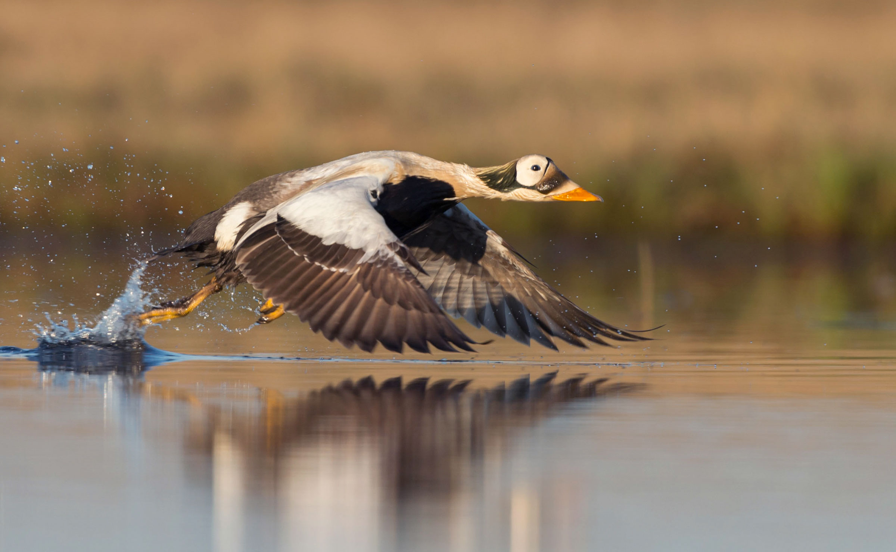

# **Environmental Management** {-#mangement}

The dataset(s) featured in this section are primarly environmental mangement focused. Environmental management is concerned with the understanding of the structure and function of the earth system, as well as of the ways in which humans relate to their environment. Environmental management is therefore concerned with the description and monitoring of environmental changes, with predicting future changes and with attempts to maximise human benefit and to minimise environmental degradation due to human activities. Read more [here](https://www.soas.ac.uk/cedep-demos/000_P500_ESM_K3736-Demo/unit1/page_10.htm). 

##  Sustaining ecological and subsistence functions in conservation areas: eider habitat and access by Native hunters along landfast ice, Alaska {-#section-eider}

*King Eider [(Source)](https://animals.net/king-eider/)*

**The Data**

[ Sustaining ecological and subsistence functions in conservation areas: eider habitat and access by Native hunters along landfast ice, Alaska, 1997-2011.](https://arcticdata.io/catalog/view/doi%3A10.18739%2FA28C9R436)

This dataset is brought to you by Aariel Rocha, James Lovvorn, Andrew Mahoney, and Stephen Jewett. The Principal Investigator [James Lovvorn](https://zoology.siu.edu/faculty-staff/faculty/current-faculty/lovvorn-j.php) (he/him), is a Professor at Southern Illinois University. His research group seeks to understand linkages between mobile top predators (birds) and aquatic food webs.

The full paper associated with this dataset is avalible [here](https://doi.org/10.1017/S0376892918000103).

**What We Know**

In the Arctic, rapid climate change has kindled efforts to delineate and project the future of important habitats for marine birds and mammals. These animals are vital to subsistence economies and cultures, so including the needs of both animals and hunters in conservation planning is key to sustaining social-ecological systems. 

In the northeast Chukchi Sea, a nearshore corridor of open water is a major spring migration route for half a million eider ducks that are hunted along the landfast ice. Zoning areas for industrial activities or conservation should consider both eider habitat and hunter access to those habitats from the variable ice edge. 

**What we found out**

Based on benthic sampling in 2010‒2012, a model of eider foraging energetics and satellite data on ice patterns in April and May 1997‒2011, we mapped the range of positions of the landfast ice edge relative to a given dispersion of habitat suitable for eider feeding. In some sectors, feeding areas were too limited or too far from landfast ice to provide regular hunting access. 

In other sectors, overlap of the ice edge with eider feeding habitat was quite variable, but often within a consistent geographic range. Areas accessible to hunters were a small fraction of total eider habitat, so areas adequate for conserving eiders would not necessarily include areas that meet the hunters’ needs. 